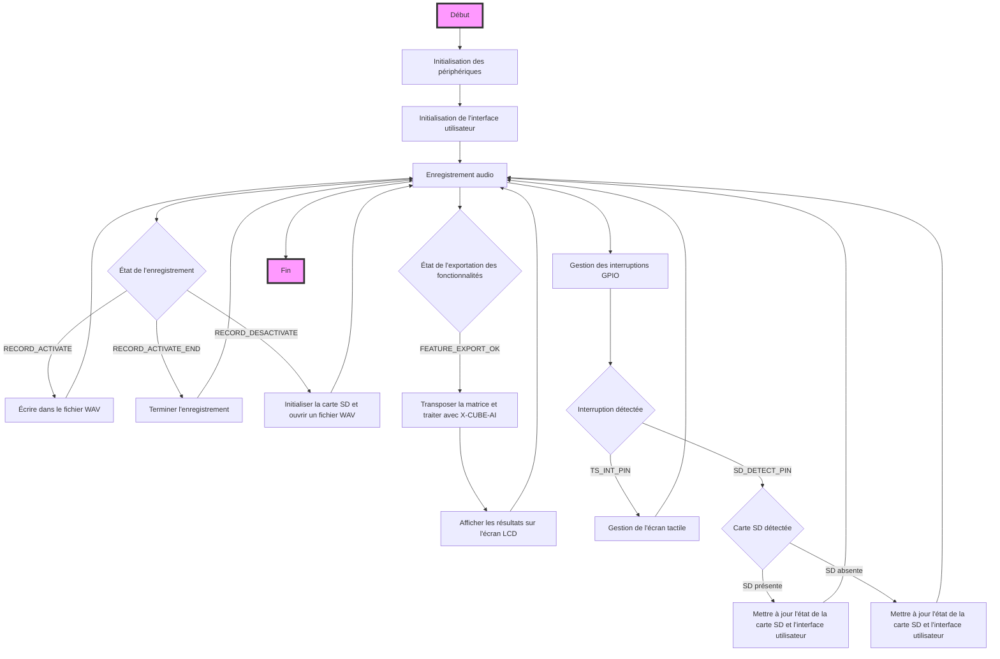

# Diagramme du programme

```mermaid
graph TD
    A[Début] --> B[Initialisation des périphériques]
    B --> C[Initialisation de l'interface utilisateur]
    C --> D[Enregistrement audio]
    D --> E{État de l'enregistrement}
    E -->|RECORD_ACTIVATE| F[Écrire dans le fichier WAV]
    E -->|RECORD_ACTIVATE_END| G[Terminer l'enregistrement]
    E -->|RECORD_DESACTIVATE| H[Initialiser la carte SD et ouvrir un fichier WAV]
    F --> D
    G --> D
    H --> D
    D --> I{État de l'exportation des fonctionnalités}
    I -->|FEATURE_EXPORT_OK| J[Transposer la matrice et traiter avec X-CUBE-AI]
    J --> K[Afficher les résultats sur l'écran LCD]
    K --> D
    D --> L[Gestion des interruptions GPIO]
    L --> M{Interruption détectée}
    M -->|TS_INT_PIN| N[Gestion de l'écran tactile]
    M -->|SD_DETECT_PIN| O{Carte SD détectée}
    O -->|SD présente| P[Mettre à jour l'état de la carte SD et l'interface utilisateur]
    O -->|SD absente| Q[Mettre à jour l'état de la carte SD et l'interface utilisateur]
    P --> D
    Q --> D
    N --> D
    D --> R[Fin]

    style A fill:#f9f,stroke:#333,stroke-width:4px
    style R fill:#f9f,stroke:#333,stroke-width:4px
```
